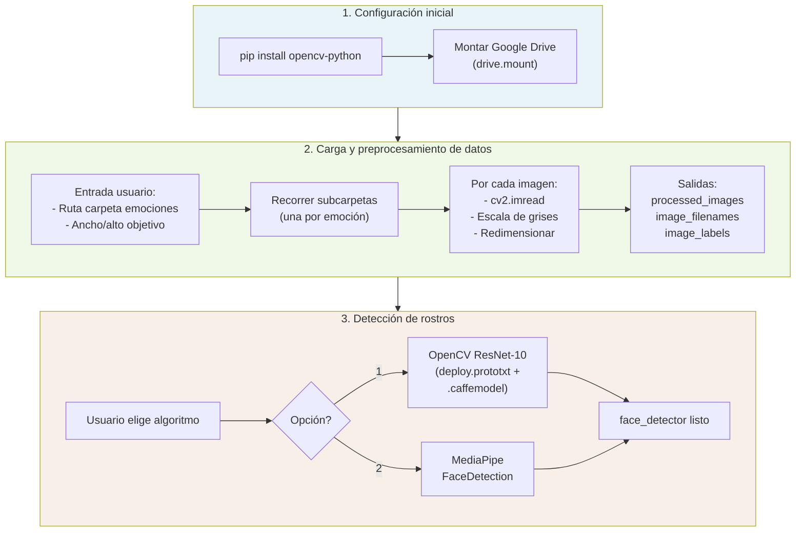

# Arquitectura del notebook Ejercicio_Final

Diagrama del flujo y componentes del código del notebook de detección de emociones (Visión por Computadora).



## Resumen de bloques

| Bloque | Celdas | Responsabilidad |
|--------|--------|-----------------|
| **Configuración inicial** | 1–3 | Dependencias (OpenCV), montaje de Google Drive para acceder a datos y modelos. |
| **Carga y preprocesamiento** | 5–6 | Ruta y dimensiones por usuario; carga imágenes por carpeta de emoción; conversión a escala de grises y redimensionado; salidas: `processed_images`, `image_filenames`, `image_labels`. |
| **Detección de rostros** | 7–8 | Elección de algoritmo (1: OpenCV ResNet-10, 2: MediaPipe); carga del modelo correspondiente; objeto `face_detector` listo para uso posterior. |

## Dependencias externas

- **opencv-python**: lectura de imágenes, preprocesamiento (escala de grises, resize), DNN ResNet-10.
- **google.colab.drive**: acceso a datos y archivos de modelo en Drive.
- **mediapipe** (si se elige opción 2): detección de rostros con MediaPipe.

## Flujo de datos

```
Google Drive (carpetas por emoción)
    → Imágenes en disco
    → Preprocesamiento (gris, resize)
    → processed_images, image_labels
    → [Uso posterior: face_detector + clasificador de emociones]
```
